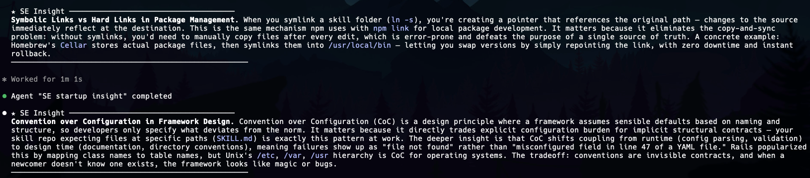

# se-insights

Bite-sized software engineering insights for passive learning while AI agents handle implementation.

## What it does

- **Startup mode** — at each session start, delivers an intermediate/advanced SE concept adjacent to your recent git work (non-blocking, runs in background)
- **Post-implementation mode** — after substantial features/bug fixes, explains the engineering decisions and underlying concepts

Insights are logged to `~/.claude/insights/log.md` as a searchable personal knowledge base.

## Example



## Installation

```bash
ln -s ~/Downloads/claude-code-skills/se-insights ~/.claude/skills/se-insights
```

### Required: CLAUDE.md trigger

Add this to your `~/.claude/CLAUDE.md` so the startup insight fires every session:

```markdown
## SE Insights
At the start of every conversation, invoke the `se-insights` skill.
```

### Optional: shared persistence directory

The skill auto-creates `~/.claude/insights/` on first run. To set it up manually:

```bash
mkdir -p ~/.claude/insights
touch ~/.claude/insights/topics.md
echo "# SE Insights Log" > ~/.claude/insights/log.md
```
